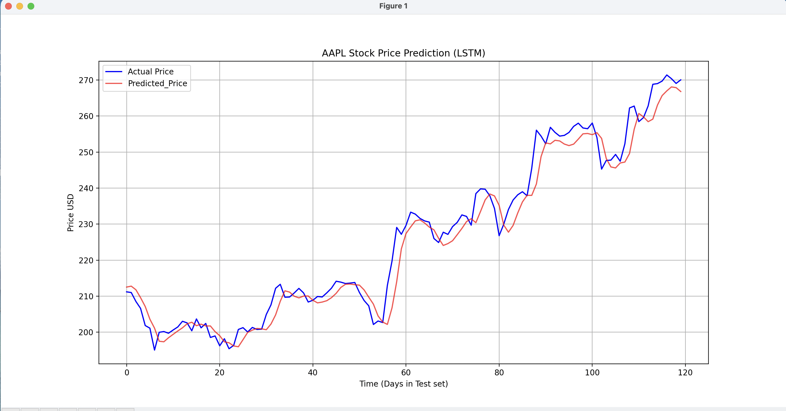

# LSTM Stacked Model for Stock Price Prediction

This project implements a Stacked Long Short-Term Memory (LSTM) Neural Network using TensorFlow/Keras to perform Time Series Forecasting on historical stock data. 
The goal is to predict the future price trend of a major stock, demonstrating expertise in sequence modeling and advanced data pipeline management.

## Project Goal
The primary objective was to build an end-to-end pipeline that can:
- Acquire real-world, high-volume financial data (yfinance).
- Transform sequential data into the necessary 3D structure for Recurrent Neural Networks (RNNs).
- Train a deep learning model to accurately track and forecast financial trends.

## Key Results and Performance
The model successfully learned the sequential patterns in the data, as evidenced by the test plot:
- **Model Success:** The Predicted Price line (Red) closely follows the Actual Price line (Blue) on the unseen test set, confirming the model learned the stock's trend dynamics.
- **Successful Inverse Transformation:** The Y-axis shows accurate dollar values, confirming the successful de-normalization process.
- **Performance Metric (RMSE):** The low Root Mean Squared Error (RMSE) value in predict.py file shows minimal prediction error in dollar terms.

## Final Prediction Plot

## Methodology and Technical Stack
The project is structured into two main scripts: a Data Utility script and the Training/Prediction script.

**1. fetch_data.py (The Data Utility Pipeline)**
- This script executes the critical preprocessing steps required for time-series modeling:

  - **Acquisition:** Fetches 5 years of historical data for ticker AAPL using the yfinance library.
  - **Normalization:** Scales the data to the [0,1] range using MinMaxScaler. The scaler object is saved to be reused later for de-normalization.
  - **Sequence Transformation:** Transforms the 2D price history into the mandatory 3D format (Samples,60 Timesteps,1 Feature) required for LSTM input.
  - **Splitting:** Splits the sequences into 80% Train, 10% Validation, and 10% Test sets.

**2. train.py and predict.py**

- **Architecture:** A Sequential Stacked LSTM model consisting of two 50-unit LSTM layers, utilizing return_sequences=True on the first layer.
- **Training:** Compiled with the adam optimizer and mean_squared_error (MSE) loss function (appropriate for regression tasks).
- **Inference:** predict.py loads the trained model and performs the crucial scaler.inverse_transform() to convert the normalized predictions back into real-world dollar amounts for accurate evaluation and visualization.

## Requirements
To run this project, you need the following Python libraries installed in your virtual environment:

**For MacOS:**

pip3 install tensorflow numpy pandas matplotlib scikit-learn yfinance
